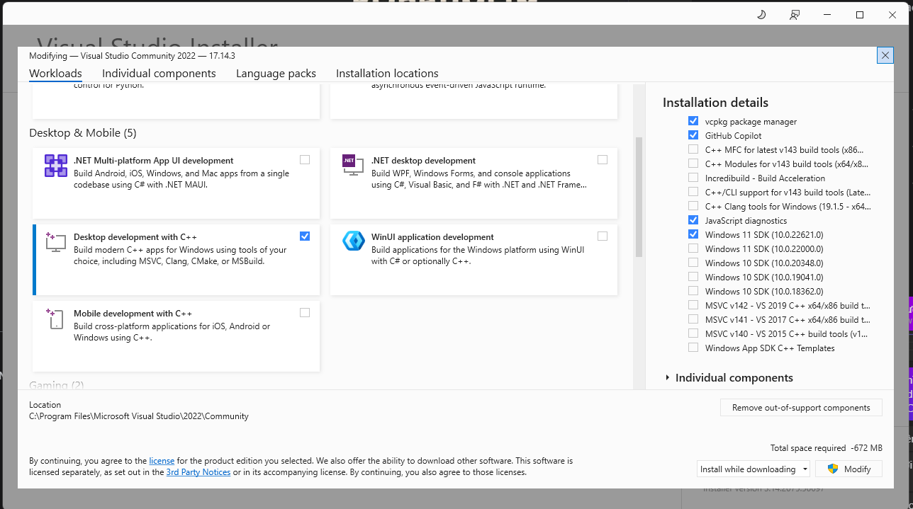

# Đường dẫn file báo cáo

> .Report\

## Hướng dẫn chạy:

'''
Khởi chạy dự án với Visual Studio( khuyến khích visual studio 2022) bằng file Voxel Engine 3D.sln hoặc 
terminal 
> ./Voxel Engine 3D.sln

> Note: đảm bảo visual studio đã có module dành cho phát triển ứng dụng desktop C++ như bên dưới:

Nhấn Build và xem kết quả.
'''

### Hướng dẫn tương tác với camera

'''
F11 - Full màn hình
W - camera di chuyển tiến lên theo direction tại thời điểm nhấn.
A - camera dịch sang phải
S - camera lùi xuống theo direction tại thời điểm nhấn.
D - camera dịch sang phải.

Thao tác với chuột, chuột chạm viền màn hình để di chuyển direction của camera, hướng lên, hướng xuống, nhìn sang trái và nhìn sang phải.
'''

Test chức năng:

[Có thể thay thế các mô hình 3D miễn phí khác để kiểm tra hiệu suất của core engine tại đây](https://sketchfab.com/feed)
