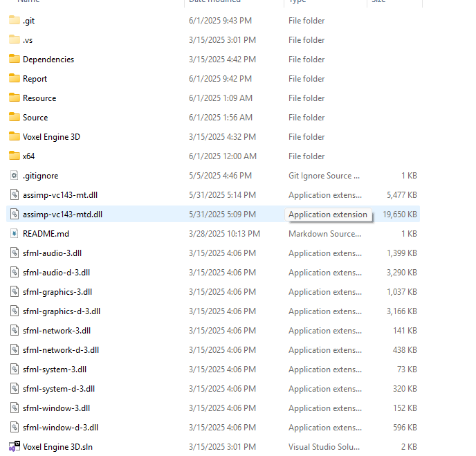

# Đường dẫn file báo cáo

> .Report\

Hướng dẫn chạy:

copy các file .dll trong đường dẫn ./Dependencies/bin/ ra ngoài đường dẫn root của thư mục như ví dụ trên

Khởi chạy dự án với Visual Studio( khuyến khích visual studio 2022) bằng file Voxel Engine 3D.sln hoặc terminal "./Voxel Engine 3D.sln"

Nhấn Build và xem kết quả.

Test chức năng:

[Có thể thay thế các mô hình 3D miễn phí khác để kiểm tra hiệu suất của core engine tại đây](https://sketchfab.com/feed)
